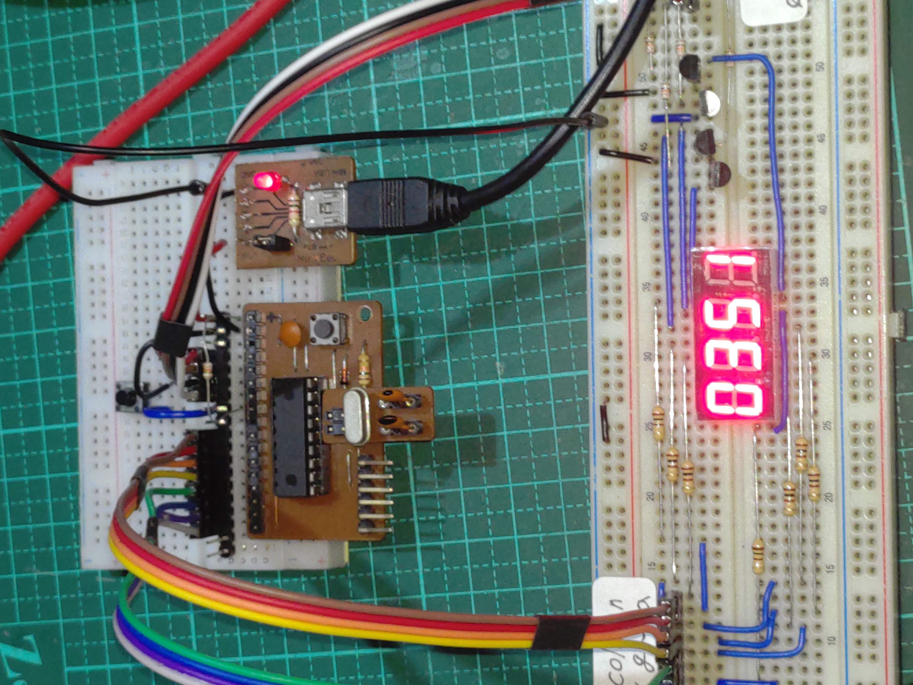

# MCU Learning
這是2024年暑假期間自學 MCU 的內容與成果。

## 學習內容
- PIC16F84A-04
- debounce、timer、states、scan display等程式原理
- 練習 C 及 assembly 語言
- 開發工具：PICKIT3、MPLAB X IDE、XC8
- simulation 及 debug

## 練習題目
- **閃爍的LED：**
  - 單一按鍵及單一LED輸出
  - 按下按鍵則LED閃爍，放開按鍵則LED熄滅
  - 無debounce
  - LED閃爍頻率約2~3Hz
- **Stopwatch：**
  - start/pause key
  - reset key：取硬體 MCLR 代替
  - 4位數seven segment LED display：表示 `分`與`秒`
  - debounce time：約 $`30msec`$
  - scan display：約 $`60Hz`$

## 學習成果
- **demo1.x：**
以C語言纂寫閃爍的LED(部份內容被Stopwatch_v1.x覆寫)。
- **Stopwatch_v1.x：**
以C語言纂寫stopwatch
- **demo2.x：**
以assembly語言纂寫閃爍的LED
- **stopwatch2.x：**
  assembly語言纂寫stopwatch
